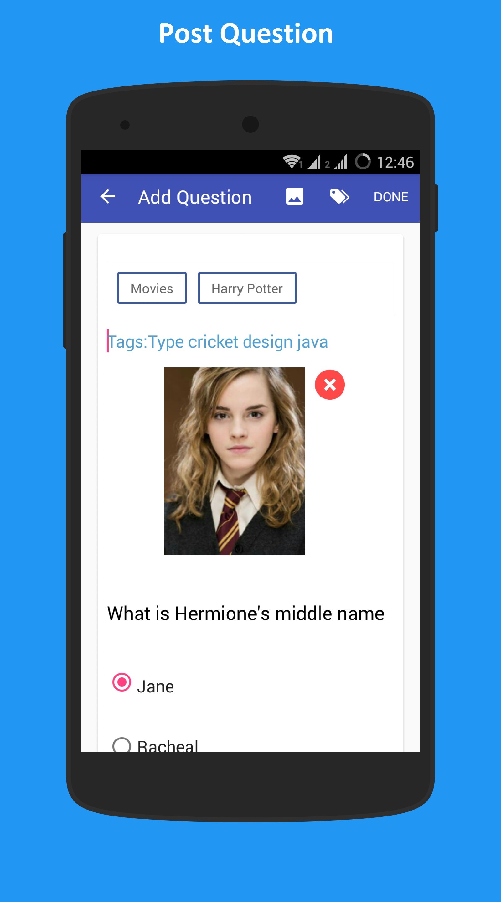
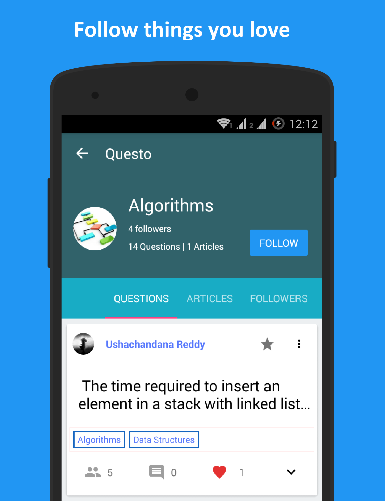

# Questo
Ask, Answer and Explore Multiple Choice Questions

Post, Discuss and Answer Questions (Multiple Choice Questions)

<h1>Screens</h1>

User can post a MCQ, write a blog, ask doubts.

Share your knowledge and know the things around

        
Features :

<b>Leadership Board :</b>

        Earn points by answering and posting questions

<b>Feed (Share your Story) :</b>

        Write something that you want to confess with world

<b>Complete Social Network : </b>

        Get notifications from tags and people you follow

<b>Integrated Quora, Stack Exchange :</b>

        To empower contextual deep linking . We also added related <b>Quora</b> and <b>Stack Exchange</b> 

<b>Note :</b>

<u>If App becomes unresponsive and repeatedly crashes ! Please clear AppData of app in settings</u>
